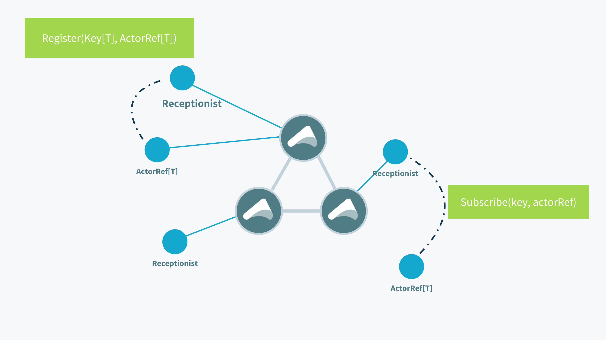
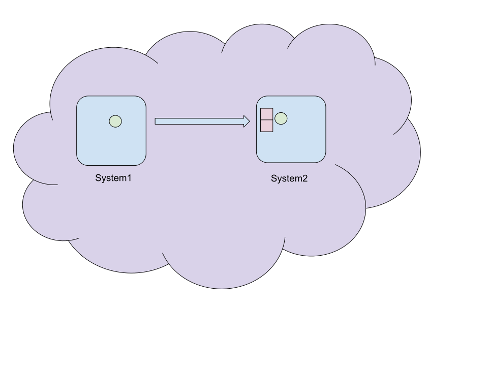

@@@section { data-background="#15a9ce" }

### State of Akka 

##### Christopher Batey (@chbatey)
##### Software Engineer - Akka team

@@@@notes

* Welcome
* Last 6 months of dev
* Some features ready, some not

@@@@

@@@

@@@section

## Akka toolkit

Actor model

@span[Clustering]

@span[Persistence (Event Sourcing)]

@span[HTTP]

@span[Streams]

@@@@notes

* Core; actor based concurrency
* Distribution and location transparency
* HTTP and streams, reactive streams

@@@@

@@@

@@@section

## New in Akka

@span[Typed refinements]{ .fragment }

@span[Multi DC]{ .fragment }

@span[gRPC]{ .fragment }

@span[Artery TCP]{ .fragment }

@span[Stream Refs]{ .fragment }

@@@@notes

* Typed: Been around for a while,close to the final API
* MultiDC: Oldest feature, fully ready.
* gRPC, in early release
* Early realease, ready to be battle tested
* Stream refs also fully ready

@@@@

@@@

@@@section

## Akka Typed

@@@@notes

* Prototype
* Runtime vs API
* API may change

@@@@

@@@


@@@section

@@snip[x]($root$/../akka-typed-sample/src/main/scala/info/batey/akka/UntypedActors.scala){ #protocol }

@@@@notes

* Look at untyped API

@@@@

@@@

@@@section

@@snip[x]($root$/../akka-typed-sample/src/main/scala/info/batey/akka/UntypedActors.scala){ #mutable }

@@@@notes

* Can be hard to understand
* State implicit

@@@@

@@@

@@@section

@@snip[x]($root$/../akka-typed-sample/src/main/scala/info/batey/akka/UntypedActors.scala){ #become }

@@@@notes

* Next step iS FSM

@@@@

@@@

@@@section

## Akka Typed

* `ActorRef` becomes `ActorRef[T]`
* No more Actor trait
* No more `sender()`
* No more `actorSelection`

@@@@notes

Notes

@@@@

@@@

@@@section

## Akka Typed

* Send 0+ messages
* Spawn 0+ children
* Change its behavior

@@@@notes

TODO

@@@@

@@@

@@@section

@@snip[x]($root$/../akka-typed-sample/src/main/scala/info/batey/akka/TypedActors.scala){ #protocol }
@@snip[x]($root$/../akka-typed-sample/src/main/scala/info/batey/akka/TypedActors.scala){ #protocol-return .fragment }

@@@@notes

* Mandatory to have a single type of a top level type
* Any responses become explicit

@@@@

@@@

@@@section

@@snip[x]($root$/../akka-typed-sample/src/main/scala/info/batey/akka/TypedActors.scala){ #state-locked }
@@snip[x]($root$/../akka-typed-sample/src/main/scala/info/batey/akka/TypedActors.scala){ #state-unlocked .fragment }

@@@@notes

* Explicit states
* Behaviors.same
* unlocked here is another
* Using methods params used to store state

@@@@


@@@

@@@section



@@@@notes

Notes

@@@@

@@@

@@@section

## Receptionist

```scala
ActorRef[Receptionist.Command]
```

```scala
case class Find[T] (...) extends Command
case class Subscribe[T] (...) extends Command
```

```scala
case class Listing[T](...) extends Command
```

@@@@notes

* Receptionist
* Implemented with distributed data

@@@@

@@@

@@@section

@@snip[x]($root$/../akka-typed-sample/src/main/scala/info/batey/akka/TypedActors.scala){ #top-level }

@@@@notes

* Setup is a factory, get the actor context

@@@@

@@@

@@@section

## Ask

```scala
initialCtx.ask(initialCtx.system.receptionist)(Find(key)) {
  case Success(listing) if hasListing(key, listing) =>
    LockActorAvailable(listing.serviceInstances(key).head)
  case _ =>
    LockNotAvailable
}

```

```scala
  def ask[Req, Res](
    otherActor: ActorRef[Req])
   (createRequest: ActorRef[Res] ⇒ Req)
   (mapResponse: Try[Res] ⇒ T)
```

@@@@notes

* Ask needs to make the response type match requester's protocol
* This is an actor asking an actor.
* External asks can be typed to anything

@@@@

@@@


@@@section

@@snip[x]($root$/../akka-typed-sample/src/main/scala/info/batey/akka/TypedActors.scala){ #needs-lock-instance  }
@@snip[x]($root$/../akka-typed-sample/src/main/scala/info/batey/akka/TypedActors.scala){ #needs-lock .fragment }

@@@@notes

TODO

@@@@

@@@

@@@section

## Running

@@snip[x]($root$/../akka-typed-sample/src/main/scala/info/batey/akka/TypedActors.scala){ #running  }

@@@@notes

TODO

@@@@

@@@

@@@section

## Persistence

@@@


@@@section

## Persistence

```scala
case class Command(data: String)
case class Event(data: String)
case class State(events: List[String] = Nil)
```

```scala
val behavior: Behavior[Command] =
  PersistentBehaviors.receive[Command, Event, State](
    persistenceId = "abc",
    initialState = State(),
    commandHandler = (ctx, state, cmd) ⇒ ???,
    eventHandler = (state, evt) ⇒ ???)
```


@@@@notes

* Auto snapshotting
* Type safe event adapters

@@@@

@@@


@@@section

## Command Handler

```scala
val commandHandler: CommandHandler[Command, Event, State] =
  CommandHandler.command {
    case Cmd(data) ⇒ Effect.persist(Evt(data))
  }
```

* Persist
* PersistAll
* Stop
* Unhandled


@@@@notes

Notes

@@@@

@@@

@@@section

## Event Handler

```scala
val eventHandler: (State, Event) ⇒ (State) = {
  case (state, Evt(data)) ⇒ state.copy(data :: state.events)
}

```

@@@@notes

Notes

@@@@

@@@

@@@section

## Persistence

* Automatic snapshotting e.g every 100 events
* Typed event adapters
* Tagging without an event adapter

@@@@notes

Notes

@@@@

@@@

@@@section

## Typed

* Coexistence
* Signals e.g. PostStop
* New test kits
* Streams

@@@@notes

Notes

@@@@

@@@


@@@section

##Multi DC
@span[Running Akka cluster across DCs] { .fragment }

@@@

@@@@notes

* DC aware
* Existing cluster can be run across DCs
* Gossip and membership
* Leader actions

@@@@

@@@section

## Multi DC

@span[Membership management during partitions]{ .fragment }

@span[Singletons and sharding]{ .fragment }

@span[Distributed data]{ .fragment }

@@@@notes

* Why do ppl use multi DCs?
    * Fault tolerance
    * Data locality

@@@@

@@@

@@@section


@@@@notes

* Failure detection
* UnreachableDatacenter

@@@@

@@@

@@@section

## Sharding and singletons

@@@@notes

* Run separately, one per DC
* How to use the singleton or shard in a different DC?

@@@@

@@@

@@@section

## Data Center A

@@snip[x]($root$/../akka-cluster-sample/src/main/scala/info/batey/akka/typed/TypedClusterApp.scala){ #dc-config }

@@snip[x]($root$/../akka-cluster-sample/src/main/scala/info/batey/akka/typed/TypedClusterApp.scala){ #extension .fragment }

@@snip[x]($root$/../akka-cluster-sample/src/main/scala/info/batey/akka/typed/TypedClusterApp.scala){ #singleton .fragment }

@@snip[x]($root$/../akka-cluster-sample/src/main/scala/info/batey/akka/typed/TypedClusterApp.scala){ #messages .fragment }

@@@@notes

Notes

@@@@

@@@


@@@section

## Data Center B

@@snip[x]($root$/../akka-cluster-sample/src/main/scala/info/batey/akka/typed/TypedClusterApp.scala){ #dc-config-b }
@@snip[x]($root$/../akka-cluster-sample/src/main/scala/info/batey/akka/typed/TypedClusterApp.scala){ #proxy .fragment }
@@snip[x]($root$/../akka-cluster-sample/src/main/scala/info/batey/akka/typed/TypedClusterApp.scala){ #proxy-send .fragment }

@@@@notes

* Ask for akka typed
* No mapTo

@@@@

@@@

@@@section

## Artery

@@@


@@@section

## Artery

* Aeron based artery is UDP based
* New TCP Artery uses Streams TCP
* Supports TLS

@@@@notes

* Requires full cluster restart

@@@@

@@@

@@@section

## Artery advantages

* Control message stream
* Large message stream
* Mostly allocation free
* Built in flight recorder

@@@

@@@section

## Stream refs

@span[Reactive streams over the network]{ .fragment }

@@@@notes

* Assume streams knowledge

@@@@

@@@

@@@section



@@@@notes

* Cluster

@@@@

@@@

@@@section


@@@

@@@section


@@@


@@@section

@@snip[x]($root$/../akka-overview/src/main/scala/info/batey/akka/streams/StreamRefs.scala){ #source-ref }

@@@@notes

Hrmm

@@@@

@@@

@@@section

## SourceRef

```scala
trait SourceRef[T] {
  def source: Source[T, NotUsed]
}
```

@@@

@@@section

@@snip[x]($root$/../akka-overview/src/main/scala/info/batey/akka/streams/StreamRefs.scala){ #source-ref-run }

@@@

@@@section

## Under the hood

* Message ordering
* Demand propagation
* Subscription timeouts

@@@@notes

* Messages are ordered
* Demand redelivery
* If subscription timeout the materialization will fail

* TCP flow control,
* serialization, TCP, connection pooling
* Assigning ports

@@@@

@@@

@@@section

## Akka gRPC

@@@@notes

* Very new
* gRPC running on akka http

@@@@

@@@

@@@section


@@@@notes

* Interface first
* Language agnostic
* Built on HTTP2
* Streaming support

@@@@

@@@

@@@section

@@snip[x]($root$/../akka-grpc-sample/src/main/protobuf/GreeterService.proto){ #service }

@@@@notes

* Language agnostic

@@@@

@@@

@@@section

```scala
new StreamObserver[T]() {
  override def onNext(summary: T): Unit = { ... }
  override def onError(t: T): Unit = { ... }
  override def onCompleted(): Unit = { ... }
}
```
@@@

@@@@notes

* Not particularly composable
* Usecase fits akka streams

@@@@


@@@section

## Unary calls

@@snip[x]($root$/../akka-grpc-sample/src/main/protobuf/GreeterService.proto){ #unary }
@@snip[x]($root$/../akka-grpc-sample/src/main/scala/info/batey/akka/GreeterServiceImpl.scala){ #unary .fragment }

@@@@notes

Notes

@@@@

@@@

@@@section

## Client streaming

@@snip[x]($root$/../akka-grpc-sample/src/main/protobuf/GreeterService.proto){ #stream-in }
@@snip[x]($root$/../akka-grpc-sample/src/main/scala/info/batey/akka/GreeterServiceImpl.scala){ #stream-in .fragment }

@@@@notes

Notes

@@@@

@@@

@@@section

## Server streaming

@@snip[x]($root$/../akka-grpc-sample/src/main/protobuf/GreeterService.proto){ #stream-out }
@@snip[x]($root$/../akka-grpc-sample/src/main/scala/info/batey/akka/GreeterServiceImpl.scala){ #stream-out .fragment }

@@@@notes

Notes

@@@@

@@@

@@@section

## Stream both ways

@@snip[x]($root$/../akka-grpc-sample/src/main/protobuf/GreeterService.proto){ #stream-both }
@@snip[x]($root$/../akka-grpc-sample/src/main/scala/info/batey/akka/GreeterServiceImpl.scala){ #stream-both .fragment }

@@@@notes

Notes

@@@@

@@@

@@@section

@@snip[x]($root$/../akka-grpc-sample/src/main/scala/info/batey/akka/MainApp.scala){ #service }

@@snip[x]($root$/../akka-grpc-sample/src/main/scala/info/batey/akka/MainApp.scala){ #binding .fragment }

@@@@notes

* Can be combined with other HTTP Routes

@@@@

@@@

@@@section

@@snip[x]($root$/../akka-grpc-sample/src/main/scala/info/batey/akka/MainApp.scala){ #client }

@@snip[x]($root$/../akka-grpc-sample/src/main/scala/info/batey/akka/MainApp.scala){ #unary .fragment }

@@snip[x]($root$/../akka-grpc-sample/src/main/scala/info/batey/akka/MainApp.scala){ #client-streaming .fragment }

@@snip[x]($root$/../akka-grpc-sample/src/main/scala/info/batey/akka/MainApp.scala){ #streaming-both .fragment }

@@@@notes

Notes

@@@@

@@@

@@@section

## gRPC Summary

* Very new!
* HTTP2 only works with bindAndHandleAsync
* Client uses Netty, will use Akka HTTP client soon

@@@@notes

Notes

@@@@

@@@

@@@section

## Summary

* @span[Typed refinements]{ }
* @span[Multi DC]{ }
* @span[Artery TCP]{ }
* @span[Stream Refs]{ }
* @span[gRPC]{ }

@@@


@@@section

## Happy hAkking!

Slides & Code
:  [github.com/chbatey/akka-talks](https://github.com/chbatey/akka-talks)

Docs & QuickStarts
:  [akka.io](https://akka.io), [developer.lightbend.com/start](https://developer.lightbend.com/start)

Community
: [gitter.im/akka/akka](https://gitter.im/akka/akka)

Tweet
: [@akkateam](https://twitter.com/akkateam), [@chbatey](https://twitter.com/chbatey)

@@@

@@@section

# Questions?

@@@


@span[$selectedLanguage$]{#selectedLanguage}

@@@vars
<script>
  const selectedLanguage = document.getElementById('selectedLanguage').innerHTML.toLowerCase()
  const hiddenLanguage = (selectedLanguage == "java") ? "scala" : "java"

  console.log(selectedLanguage)
  var javaFragments = document.getElementsByClassName('group-' + hiddenLanguage)
  while (javaFragments.length > 0) {
    javaFragments[0].remove()
  }
</script>
@@@
