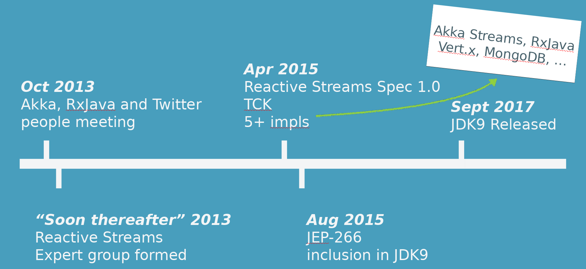

@@@section { data-background="#15a9ce" }

### Responsive, back-pressured services with Akka 

##### Christopher Batey 
##### @chbatey

@@@@notes

* Me
* Lightbend: Scala, Akka, Play
* Responsive systems using async, resource efficient
* Scalable systems that behave well under load

@@@@

@@@

@@@section

## Akka toolkit

Actor model

@span[Clustering]{ .fragment }

@span[Persistence (Event Sourcing)]{ .fragment }

@span[HTTP]{ .fragment }

@span[Streams]{ .fragment }

@@@@notes

* Core; actor based concurrency
* Distribution and location transparency
* HTTP and streams, reactive streams

@@@@


@@@


@@@section

## Responsive

* For a single request
* Remain responsive under load

@@@@notes

* 2.5 mins
* Hanging, crashing vs being slow
* Capacity planned to 1000 concurrent requests
* Sized your hear to 2GB

@@@@


@@@


@@@section

## Scalable

* Single process scalability or resource efficiency
* Multi node scalability

@@@@notes

- Scalable for those who need it. E.g. 5TPS on a huge box
- Scalable in process: Execution model appropriate
- Resource efficiency
- Scalable across machines


@@@@

@@@

@@@section

## Asynchronous

* Programming model
    * CompletableFuture from the JDK
    * Scala Futures
    * Actors and Streams from Akka
    * Observables and Flowables from RxJava
* Network/IO
    * Does a request over the network use a Thread?
    * Does accessing the file system use a Thread?


@@@@notes

* Typical synchronous thread per request programming model
* How many threads do you need to service a 1000 concurrent requests?
* Async programming model vs actually async all the way down

@@@@

@@@

@@@section

## Back pressure

* How do we stop a fast producer overloading a slow consumer?
* How is demand signalled?
* How do we prevent bring data from a database at a faster rate than the client can consumer?

@@@@notes

* 8 mins
* Dealing with components that run at different speeds
* Accepting connections vs how our database is responding
* How quickly do we pull data from a database when it is unbounded?
* Default is to not take it into consideration
* Much more important when moving away from thread per request
* Online television service, big football game

@@@@

@@@


@@@section

## Presentation take aways

* What does async give us?
* What does flow control give us?
* What is the reactive streams specification?
* Flow control with Akka streams
* Http Client -> TCP -> Http Server -> TCP -> Apache Cassandra (slow client)

@@@@notes

* 10 minutes
* So far just asked a lot of questions
* 45 mins on the talk, then 15 mins of demo.

@@@@

@@@

@@@section

## Use case

* HTTP Service, endpoints for:
    * User information from database
    * Getting user activity over a large time span

@@@@notes

* 11 mins
* Small request vs large request
* Second is an unbounded response
* Local Cassandra database with hundreds of millions of events, around .5 GB. Run with a small HEAP

@@@@

@@@

@@@section

## Requirements 

* Respond in a timely manner, even if it is a failure
* Don't do any unnecessary work
* Constant memory footprint

@@@@notes

* Resource efficiency/scalability 
* Dont pull large amounts from database if the client isn't reading it
* Don't continue computations
* Easier if synchronous, as thead can become blocked
* Small heap. Even when using libraries designed for this it is easy to accidently
pull everything into memory

@@@@

@@@

@@@section


@@@@notes

* 14 mins
* Not just worry about the yellow bit
* Slow client
* Dependencies
    * Don't make their problem your problem


@@@@

@@@

@@@section

## Execution Models 

@@@@notes

* 15 minutes
* Time for code and details, then demo
* Thread per request, hystrix
* Future based programming
* Akka stream based programming

@@@@


@@@

@@@section

### Traditional synchronous model

@@snip[Synchronous.java]($root$/../http-streams/src/main/java/rs/async/Synchronous.java){#service}

@@snip[Synchronous.java]($root$/../http-streams/src/main/java/rs/async/Synchronous.java){#perform}

@@@@notes
* Multiple tasks done after another?
* Perhaps submit them to a thread pool? Very low level
* Network vs compute

@@@@

@@@

@@@section

### Asynchronous actor approach

@@snip[x]($root$/../http-streams/src/main/java/rs/async/Asynchronous.java){#actor group="java"}

@@snip[x]($root$/../http-streams/src/main/java/rs/async/Asynchronous.java){#enqueue group="java"}

@@snip[x]($root$/../http-streams/src/main/scala/rs/async/Asynchronous.scala){#actor group="scala"}

@@snip[x]($root$/../http-streams/src/main/scala/rs/async/Asynchronous.scala){#enqueue group="scala"}

@@@@notes

* Task in mailbox. Saves threads.
* Resilience. Back a slide, highlight the sending thread no longer has to deal with the exception
* Just one way to make this async

@@@@

@@@

@@@section


@@snip[SynWebService.scala]($root$/../sync-examples/src/main/scala/info/batey/sync/SyncWebFramework.scala){#sync-post group="scala"}

@@snip[SynWebService.scala]($root$/../sync-examples/src/main/java/jdoc/info/batey/sync/SyncWebFramework.java){#sync-post group="java"}

@@@@notes

* 18m 
* JAX-RS, Spring
* WOrks well for CPU bound tasks
* Dropwizard with Jetty default # of threads is 1024
* Probably got some annotations for serialisation
* Inherently not scalable

@@@@

@@@

@@@section

@@snip[SynWebService.scala]($root$/../sync-examples/src/main/scala/info/batey/sync/SyncWebFramework.scala){#sync-post-times group="scala"}

@@snip[SynWebService.scala]($root$/../sync-examples/src/main/java/jdoc/info/batey/sync/SyncWebFramework.java){#sync-post-times group="java"}

@@@@notes

* Very hard for sync to time a request out
* TCP connection/receive timeouts

@@@@

@@@


@@@section

## Asynchronous

@@snip[x]($root$/../http-streams/src/main/scala/info/batey/akka/http/AsyncWebFramework.scala){#async-request group="scala"}

@@snip[x]($root$/../sync-examples/src/main/java/jdoc/info/batey/sync/AsyncWebFramework.java){#async-request group="java"}

* Timeout independent to dependency times
* Option not to block on IO
* Works well for small responses that are ready to go


@@@@notes

* Rather than
* This function completes right away. Web framework then puts a callback on the future
* How do we decide how many concurrent requests we can handle?

@@@@

@@@

@@@section

@@snip[SynWebService.scala]($root$/../sync-examples/src/main/scala/info/batey/sync/SyncWebFramework.scala){#async-request group="scala"}

@@snip[x]($root$/../sync-examples/src/main/java/jdoc/info/batey/sync/AsyncWebFramework.java){#async-request2 group="java"}

@@@@notes

* thenCompose - chain on another async comp
* thenApply - transform the result once it is complete

@@@@

@@@


@@@section

## Akka HTTP

@@snip[x]($root$/../http-streams/src/main/scala/info/batey/akka/http/UserRoute.scala){#user-route group="scala"}

@@snip[x]($root$/../http-streams/src/main/java/j/info/batey/akka/http/UserRoute.java){#user-route group="java"}

@@@

@@@section

## Akka HTTP

@@snip[x]($root$/../http-streams/src/main/scala/info/batey/akka/http/UserRoute.scala){#user-route }

@@@@notes

* Future rather than a sync method call
 * We can easily add a timeout that Akka HTTP can handle

@@@@

@@@


@@@section

@@snip[x]($root$/../http-streams/src/main/scala/info/batey/akka/http/DataAccess.scala){#db-call group="scala"}

@@snip[x]($root$/../http-streams/src/main/java/j/info/batey/akka/http/DataAccess.java){#db-call group="java"}


@@@@notes

* Quick look at what an async call to a DB might look like

@@@@

@@@

@@@section

##  Responsiveness under load

@@@@notes

* 25 mins
* Recap:
    * Async allows us to use fewer threads
    * Async allows us to respond even if the request isn't fished
* HOWEVER:
    * A new problem, when do we stop takig in requests?

@@@@

@@@

@@@section

# Playing fair

@@@

@@@section


@@@@notes

* Actors - how many messages 
* Futures - How many outstanding futures

@@@@

@@@


@@@section { data-background-video="images/fishermen.mp4" }

# @span[OutOfMemoryError]{.orange .fragment}

@@@@notes

* Reactive streams

@@@@

@@@

@@@section

## Queueing and/or buffering

* How would this work if Kafka was between the services?


@@@

@@@section

## Fast publisher

* Without the queue:
  * Down stream gets overwhelmed
  * Publisher has wasted resources


@@@@notes

* Assumption that kafka never fills up
* Can't do this for in memory, can't do this for requests between services
* Would this work in memory?
* Why produce data no one is ready to consume?

@@@@

@@@

@@@section

## Reacting to failure

* Is the consumer slow or down?
* Circuit breakers


@@@

@@@section

## Flow control

* Dynamically adjust the rate based on demand


@@@


@@@section

# Reactive Streams


@@@@notes

* 30 minutes
* So let's start with Reactive Streams. To better understand the reactive streams initiative it makes sense to look at some history of there this effort came from

@@@@


@@@


@@@section

### So far the good news...

@@snip[x]($root$/../http-streams/src/main/java/rs/async/Asynchronous.java){#actor group="java"}

@@snip[x]($root$/../http-streams/src/main/java/rs/async/Asynchronous.java){#enqueue group="java"}

@@snip[x]($root$/../http-streams/src/main/scala/rs/async/Asynchronous.scala){#actor group="scala"}

@@snip[x]($root$/../http-streams/src/main/scala/rs/async/Asynchronous.scala){#enqueue group="scala"}

@@@@notes

* Async, thread efficiency
* But now when do we stop?

@@@@

@@@


@@@section { data-background="#489ebd" }

### Reactive Streams Timeline



@notes[Industry got together under Reactive Streams working group initiated by Viktor Klang of the Akka Team (not limited to JVM)]

@@@

@@@section { data-background="#489ebd" }

### Reactive Streams Scope

Reactive Streams is an initiative to provide a standard for asynchronous stream processing with non-blocking back pressure. This encompasses efforts aimed at runtime environments (JVM and JavaScript) as well as network protocols

http://www.reactive-streams.org

@@@@notes

* For communication between libraries

@@@@

@@@

@@@section

### `java.util.concurrent.Flow`

@@snip[rs]($root$/../http-streams/src/main/java/rs/Publisher.java) { #rs }
@@snip[rs]($root$/../http-streams/src/main/java/rs/Subscriber.java) { #rs }
@@snip[rs]($root$/../http-streams/src/main/java/rs/Subscription.java) { #rs }
@@snip[rs]($root$/../http-streams/src/main/java/rs/Processor.java) { #rs }

@notes[Most significant milestone was the inclusion of the RS interfaces in JDK9
If you're not on JDK9 you can use the org.reactivestreams library.]

@@@

@@@section

### Availablility

Included in JDK9

No JDK9? No problem!

```
<dependency>
  <groupId>org.reactivestreams</groupId>
  <artifactId>reactive-streams</artifactId>
  <version>1.0.2</version>
</dependency>
```

@@@


@@@section

# Akka Streams

@@@@notes

* What is Akka streams for?
* Async passing data. 
* Data might come from DB, in process computation
* Flow control is built in

@@@@

@@@

@@@section


@@@@notes

* Async streaming pipeline
* Akka HTTP treads HTTP as as stream
* Data goes from a source to a sync
* Demand goes the opposite way
* Demand is the kind of things people used to build into Actors/Futures

@@@@

@@@

@@@section

@@snip[x]($root$/../http-streams/src/main/java/streams/Intro.java){#source-no}
@@snip[x]($root$/../http-streams/src/main/java/streams/Intro.java){#flow-no .fragment}
@@snip[x]($root$/../http-streams/src/main/java/streams/Intro.java){#sink-no .fragment}

@@@@notes

* Before we dive into the specifics, let's start with some small examples to get a feel
* Not brought into memory
* Sink receives each element then it can be garbage collected
* Types coming next


@@@@

@@@

@@@section

@@snip[x]($root$/../http-streams/src/main/java/streams/Intro.java){#source}
@@snip[x]($root$/../http-streams/src/main/java/streams/Intro.java){#flow}
@@snip[x]($root$/../http-streams/src/main/java/streams/Intro.java){#sink}
@@snip[x]($root$/../http-streams/src/main/java/streams/Intro.java){#graph .fragment}
@@snip[x]($root$/../http-streams/src/main/java/streams/Intro.java){#run .fragment}

@@@@notes

* All just reuseable recipes
* Implemented under the covers using actors
* Flow control built in

@@@@

@@@

@@@section

@@snip[x]($root$/../http-streams/src/main/scala/streams/Intro.scala){#source}
@@snip[x]($root$/../http-streams/src/main/scala/streams/Intro.scala){#flow}
@@snip[x]($root$/../http-streams/src/main/scala/streams/Intro.scala){#sink}
@@snip[x]($root$/../http-streams/src/main/scala/streams/Intro.scala){#graph .fragment}
@@snip[x]($root$/../http-streams/src/main/scala/streams/Intro.scala){#run .fragment}

@@@@notes

b

@@@@

@@@

@@@section

Java:

@@snip[x]($root$/../http-streams/src/main/java/streams/Intro.java){#short}

Scala:

@@snip[x]($root$/../http-streams/src/main/scala/streams/Intro.scala){#short}

@@@@notes

* Effort has gone into making the Java/Scala API very similar

@@@@

@@@

@@@section

## Materialization

@@snip[x]($root$/../http-streams/src/main/java/streams/Materialization.java){#multiple group="java"}

@@snip[x]($root$/../http-streams/src/main/scala/streams/Materialization.scala){#multiple group="scala"}

@@@@notes

* Run multiple times
* E.g. each time a request comes into your app

@@@@

@@@


@@@section

## Actor materialization

@@snip[x]($root$/../http-streams/src/main/java/streams/Materialization.java){#fusing group="java"}

@@snip[x]($root$/../http-streams/src/main/scala/streams/Materialization.scala){#fusing group="scala"}


@@@@notes

* Each stage in your pipeline can become an actor
* Fusing. Single actor
* Downside is there is no parallelism as elements go through stream

@@@@

@@@

@@@section

# Fusing

@@snip[x]($root$/../http-streams/src/main/java/streams/Materialization.java){#fusing-explicit-async group="java"}

@@snip[x]($root$/../http-streams/src/main/scala/streams/Materialization.scala){#fusing-explicit-async group="scala"}


@@@

@@@section

# Fusing

@@snip[x]($root$/../http-streams/src/main/java/streams/Materialization.java){#fusing-async group="java"}

@@snip[x]($root$/../http-streams/src/main/scala/streams/Materialization.scala){#fusing-async group="scala"}


@@@@notes

* Also happens when using an async comp in a state mapAsync

@@@@

@@@

@@@section

## Backpressure propagation

Demand is signalled across async boundaries


@@@@notes

* Where does the flow control come in?
* Upstream stages are not allowwed to do anything until downstream 

@@@@

@@@

@@@section

## Backpressure propagation

Thanks to Reactive Streams, across different libraries:


@@@

@@@section

## Backpressure propagation

Often also possible across external protocols, i.e. TCP:


@span[]{.fragment}

@@@@notes

* Demo will show the flow control in Akka streams going into TCP

@@@@

@@@

@@@section

## Backpressure propagation

Can be seen in e.g. wireshark:


@@@@notes

Akka streams backpressure translating to TCP bacck pressurej

@@@@

@@@

@@@section

## TCP windowing


@@@@notes

- Window fills up, client stops sending
- Heart beats to know when it can start sending again

@@@@

@@@

@@@section

## Putting it all together

HTTP Client -> TCP -> Server -> HTTP Server -> TCP -> Apache Cassandra

@@@@notes

* Goal not to teach you Akka HTTP
* But to show you the benefits of using a library which adheres to flow control

@@@@

@@@

@@@section

## Putting it all together

* Akka HTTP client
* Akka HTTP server
* Alpakka 

@@@@notes

Notes

@@@@

@@@

@@@section

## Akka Client

@@snip[x]($root$/../http-streams/src/main/scala/info/batey/akka/http/ActivityClient.scala){#client-request group="java"}

@@snip[x]($root$/../http-streams/src/main/scala/info/batey/akka/http/ActivityClient.scala){#client group="java"}

@@snip[x]($root$/../http-streams/src/main/scala/info/batey/akka/http/ActivityClient.scala){#client-request group="scala"}

@@snip[x]($root$/../http-streams/src/main/scala/info/batey/akka/http/ActivityClient.scala){#client group="scala"}

@@@@notes

* Important thing to note here is that the entity is a Source
* There is a marshalling toolkit
* Remember the rule,  source can't produce data uness sink demands it
* Until you start consuming the source with a sink, nothing happens (apart from TCP buffers fill up)


@@@@

@@@

@@@section

## Akka Server

```scala
val bound: Future[Http.ServerBinding] =
    Http().bindAndHandle(route, "localhost", 8080)
```

```scala
 def bindAndHandle(
    handler:   Flow[HttpRequest, HttpResponse, Any],
    interface: String,
    port: Int)
```

@@@

@@@section

## Akka Server

@@snip[x]($root$/../http-streams/src/main/scala/info/batey/akka/http/UserRoute.scala){#stream-route group="scala"}

@@snip[x]($root$/../http-streams/src/main/scala/info/batey/akka/http/UserRoute.scala){#stream-route group="java"}

@@@@notes

* You provide a source
* Data is not pulled from the source UNTIL there is space in the TCP send buffer
* IF the buffer fills up, we stop reuquesting
* Meaning that we should stop pulling data from the database
* Compare that to the sync model

@@@@

@@@


@@@section

## Cassandra Source 

```scala
CassandraSource(new SimpleStatement(
      "select * from user_tracking where user_id = ?", userId))(session)
     .map(row => Event(
       row.getString("user_id"),
       UUIDs.unixTimestamp(row.getUUID("time")),
       row.getString("event")))
```

@@@@notes

This source is built into Alpakka that
listens to demand and only pulls rows
from the database when you request them

@@@@

@@@

@@@section

# Demo time

@@@

@@@section

## Demo summary

* HTTP slow client
    * Client makes request for a large payload
    * TCP buffers fill up
    * Server *stops* getting data from database
    * Client then demands more
    * Everything starts flowing


@@@

@@@section

## Happy hAkking!

Slides & Code
:  [github.com/chbatey/akka-streams-flow-control-example](https://github.com/chbatey/akka-streams-flow-control-example)

Docs & QuickStarts
:  [akka.io](https://akka.io), [developer.lightbend.com/start](https://developer.lightbend.com/start)

Community
: [gitter.im/akka/akka](https://gitter.im/akka/akka)

Tweet
: [@akkateam](https://twitter.com/akkateam), [@chbatey](https://twitter.com/chbatey)

@@@

@@@section

# Questions?

@@@


@span[$selectedLanguage$]{#selectedLanguage}

@@@vars
<script>
  const selectedLanguage = document.getElementById('selectedLanguage').innerHTML.toLowerCase()
  const hiddenLanguage = (selectedLanguage == "java") ? "scala" : "java"

  console.log(selectedLanguage)
  var javaFragments = document.getElementsByClassName('group-' + hiddenLanguage)
  while (javaFragments.length > 0) {
    javaFragments[0].remove()
  }
</script>
@@@
